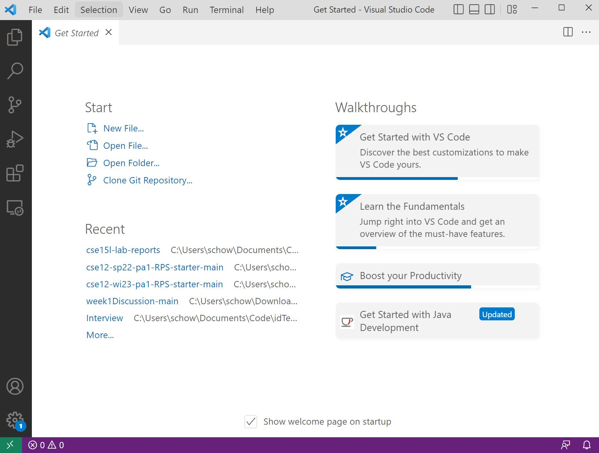
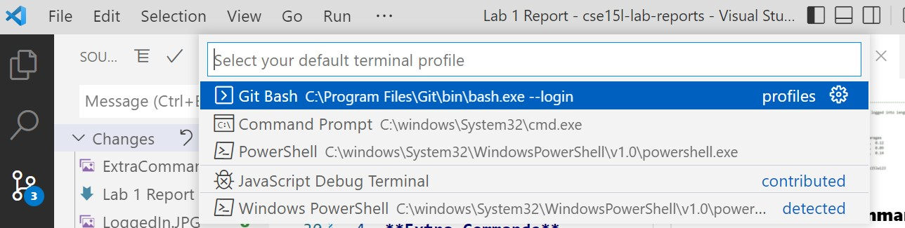
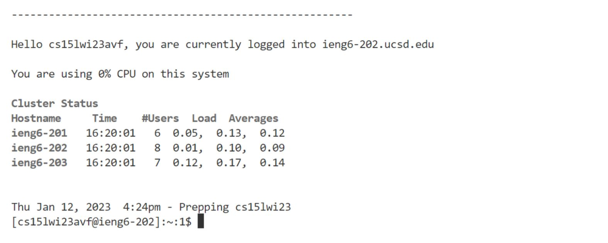
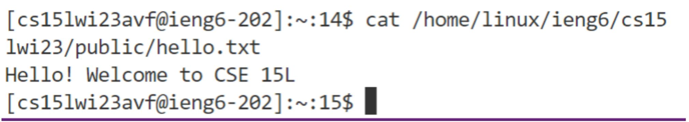
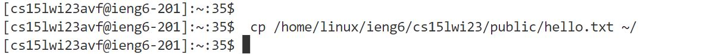

# Lab Report 1: Remotely Connecting
### January 16, 2023

For this lab, we are remotely connecting to a course-specific account. After setting the password for that account, I followed these steps.

1. **Opening VScode.**

    The first step is to install VS Code, making sure to pick the right version for your OS. I followed the link below and picked the option for Windows. 

    [https://code.visualstudio.com/download](https://code.visualstudio.com/download)	
    
    This is how it look once it was fully installed and I opened it.

    

2. **Windows Extra Steps**
    
    Then, I had to change the terminal in VS code to match one of Linux or IOS. I did this by downloading Git Bash.

    Then, I used the command palette to change the terminal, as shown below.
    
    

3. **Remotely Connecting**

    After I changed my terminal, I was able to use the *ssh* command to log into my course-specific account.

    The command was 
    
        ssh cs15lwi23avf@ieng6.ucsd.edu
    

    I was prompted to enter the password I created earlier. Then, I successfully logged in.

    

4. **Extra Commands**

    I played with some of the commands provided, such as
    
        cat /home/linux/ieng6/cs15lwi23/public/hello.txt
    

    

    This command read the contents of the text file hello.txt and printed them onto the console.

    Another command to run is 

        cp /home/linux/ieng6/cs15lwi23/public/hello.txt ~/

    This command copied the contents of the text file hello to the location specified. This command worked as expected, so nothing happened on the command line.

    
