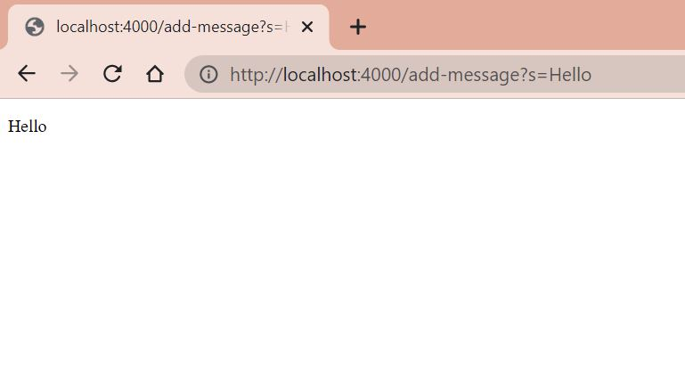
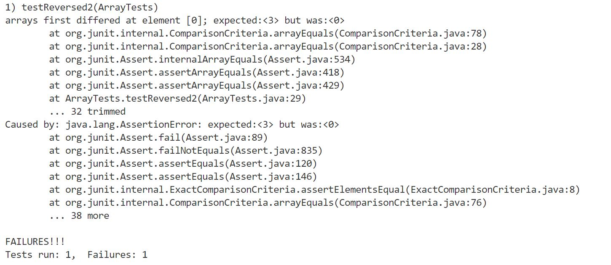
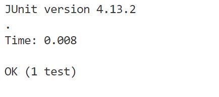

# Lab Report 2: Servers and Bugs
## Part 1

Here is my code for StringServer.java

    import java.io.IOException;
    import java.net.URI;

    class Handler implements URLHandler {
        String phrases = "";
        public String handleRequest(URI url) {
            if (url.getPath().equals("/add-message")) {
                System.out.println("Path: " + url.getPath());
                String[] parameters = url.getQuery().split("=");

                phrases += parameters[1] + "\n";

                return phrases;
            }
            return "404 Not Found!";
        }
    }

    class StringServer{
        public static void main(String[] args) throws IOException {
            if(args.length == 0){
                System.out.println("Missing port number! Try any number between 1024 to 49151");
                return;
            }
            int port = Integer.parseInt(args[0]);
            Server.start(port, new Handler());
        }
    }

Here are two screenshots showing how /add-message behaves.

First, Class Handler implements URLHandler. It inherits method handleRequest which was called first.

It read the path as */add-message* then it read the query *?s=Hello*

It used .split() on the query to seperate the words between the equal signs; those words were passed into an array. In this case, we only want what is after the equal sign, so I referenced the second element in the created array.

That element was concatenated to String phrases plus a new line; that String was returned to then print on the page.

"World" was concatenated along with a new line to print accordingly. 

The same methods as above were called to handle this second request. The only notable occurence is that the String phrases was created outside handleRequest() in order for the contents of it to be preserved through multiple method calls. 

The methods that were called include:
- main method
- start() to launch the site
- parseInt() to find the host number

The relevant values include:
-  the URL acting as a parameter
- args which is parsed for the integer denoting host number
- the String returned by handleRequest()
- the String array returned by split()
- the Server that is started with parameters of the host number and an instance of the Handler class

The values of relevant fields change to launch the new server because we picked the host number. The URL parameter is also changed since the user can add queries and commands.

## Part 2
One of the bugs from lab 3 occurred in the reverse() method.

This is the original code:

    static int[] reversed(int[] arr) {
        int[] newArray = new int[arr.length];

        for(int i = 0; i < arr.length; i += 1) {
            arr[i] = newArray[arr.length - i - 1];
        }
        return arr;
    }

A failure-inducing input would be:

    @Test
    public void testReversed() {
        int[] input1 = { };
        assertArrayEquals(new int[]{ }, ArrayExamples.reversed(input1));
    }

A non-failure-inducing input would be:

    @Test 
	public void testReversed2() {
        int[] input2 = {1,2,3};
        ArrayExamples.reversed(input2);
        assertArrayEquals(new int[]{3,2,1}, ArrayExamples.reversed(input2));
	}

The issue with it is that the method is returning the original array. Additionally, inside the for-loop, elements of the original array were getting set those of the new one which by default are all 0. To fix this bug, I set elements of the newArray equal to the old one inside the loop, then returned the newArray.

This is the fixed code:

    static int[] reversed(int[] arr) {
        int[] newArray = new int[arr.length];

        for(int i = 0; i < arr.length; i += 1) {
            newArray[i] = arr[arr.length - i - 1];
        }
        return newArray;
    }

## Part 3
Over the past two weeks, I learned how to launch a server and about the local UCSD network of computers and how you could pick which computer to access. 

Getting to try my lab mate's link was really interesting because even on a different computer, the number was getting updated. 
