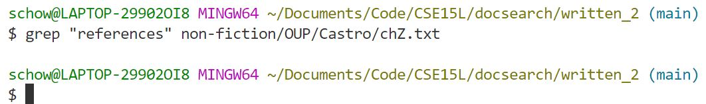
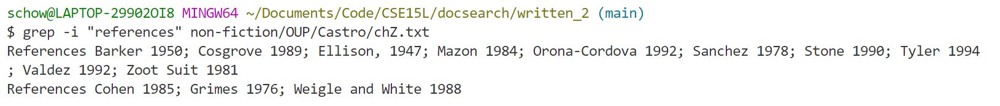
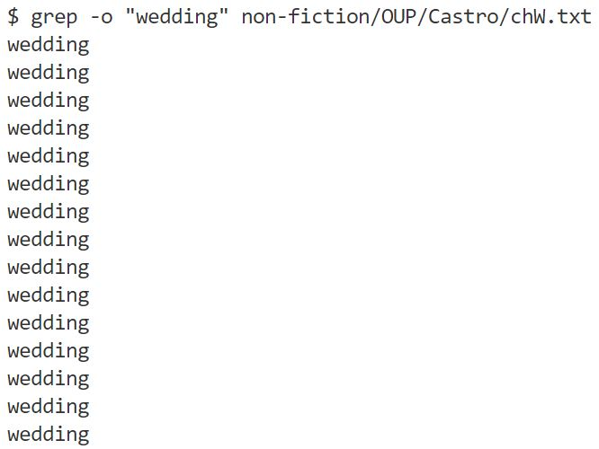
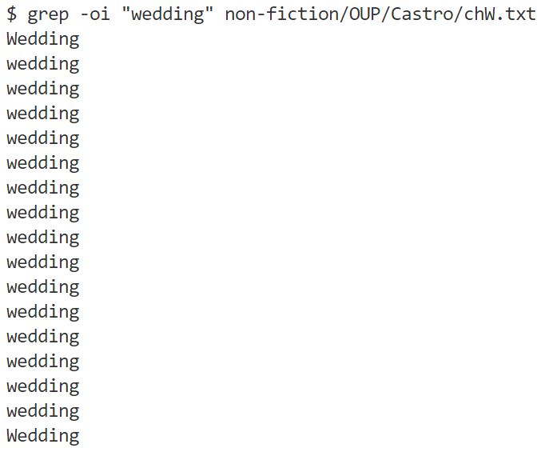
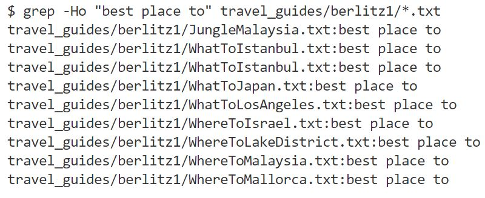
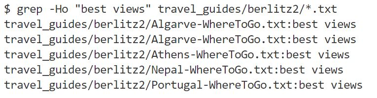
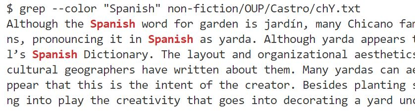
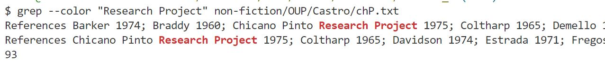

# Lab Report 3: Researching Commands

I chose to work with the command **grep**.

## 1) -i
This command is an indication to ignore the capitalization when searching for a match.

### Example 1:

    grep "references" non-fiction/OUP/Castro/chZ.txt

This is the output of grep without the extra command. It returned nothing because it found no matches.

    grep -i "references" non-fiction/OUP/Castro/chZ.txt

This is the output of grep with the extra command. It was able to find some matches because it was no longer case-sensitive.

### Example 2:

    grep -o "wedding" non-fiction/OUP/Castro/chW.txt

This command returned all instances of "wedding". For the demonstration purposes, I used the -o command to return only matching instances rather than whole lines.

    grep -oi "wedding" non-fiction/OUP/Castro/chW.txt

I added the -i command which caused grep to return instances of "wedding" and "Wedding" which is what we wanted.

source: [https://www.digitalocean.com/community/tutorials/grep-command-in-linux-unix](https://www.digitalocean.com/community/tutorials/grep-command-in-linux-unix)

---

## 2) -H
This command is an indication to print the file name with for each match.

### Example 1:

    grep -Ho "best place to" travel_guides/berlitz1/*.txt

I searched all the travel guides in berlitz1/ for the phrase "best place to". This grep command returned the file names and matching lines. I combined it with the -o command to clean up the output.

### Example 2:

    grep -Ho "best views" travel_guides/berlitz2/*.txt

Next, I searched the travel guides in berlitz2/ for the phrase "best views". One thing to note is that it returned the same file name multiple times to account for multiple instances.

source: [https://www.tomshardware.com/how-to/grep-command-linux](https://www.tomshardware.com/how-to/grep-command-linux)

---

## 3) -c
This command counts the lines where a match is found.

### Example 1:

    grep -c "India" travel_guides/berlitz/WhereToIndia.txt

I searched for the number of instances of "India" in WhereToIndia.txt. The -c command counted and returned 136 matches. 

### Example 2:

    grep -c "beach" travel_guides/berlitz2/California-WhatToDo.txt

Next, I searched for "beach" in California-WhatToDo.txt. There were 6 matches.

source: [https://man7.org/linux/man-pages/man1/grep.1.html](https://man7.org/linux/man-pages/man1/grep.1.html)

---

## 4) -color
This command colors the matching results in the output.

### Example 1:

    grep --color "Spanish" non-fiction/OUP/Castro/chY.txt

I used grep to search for the phrase "Spanish" in chY.txt. The --color command was helpful because grep prints out the entire line where the match is, but with the extra command, the match is printed in red. This allows you to see exactly where the match is.

### Example 2:

    grep --color "Research Project" non-fiction/OUP/Castro/chP.txt

I used grep to search for the phrase "Research Project" in file chP.txt. The results were printed in red as expected.

source: [https://man7.org/linux/man-pages/man1/grep.1.html](https://man7.org/linux/man-pages/man1/grep.1.html)
