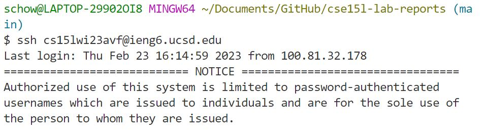
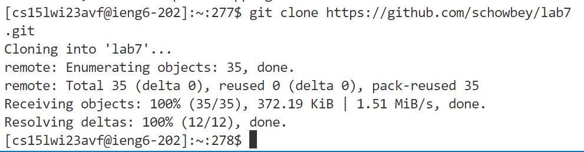
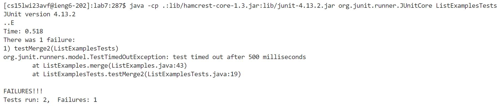
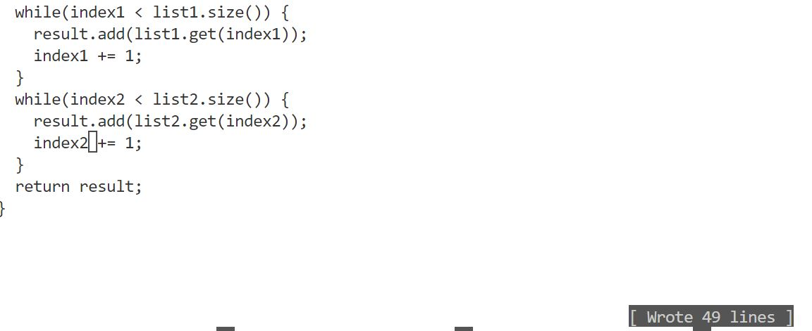
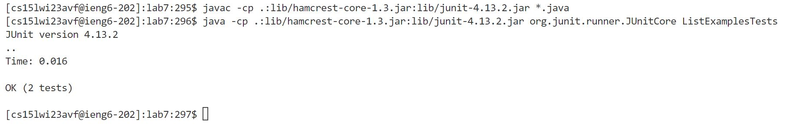
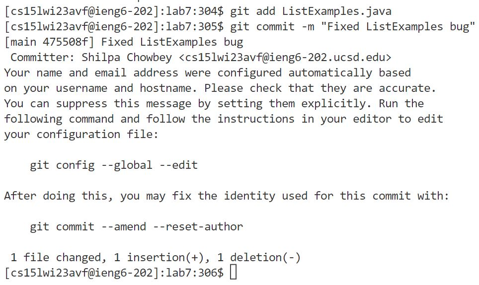

# Lab Report 4: Baseline Competiton
This lab report shows Steps 4-9 of the baseline Competition.

## Step 4: Log into ieng6.
I logged into ssh by typing the code below.

    ssh cs15lwi23avf@ieng6.ucsd.edu
    <enter>

Notably, there was no password required since we generated an empty ssh key at the beginning of lab.

## Step 5: Clone your fork of the repo from your Github account. 
After forking the repository, I got the clone URL from my account, then cloned it in the terminal.

    git clone https://github.com/schowbey/lab7.git
    <enter>

## Step 6: Run the tests (fail)
In order to run the tests, I needed to be in the lab7 directory, so I changed directories first. Then, I typed out the compile command. Then, I typed out the run command.

    cd lab7
    <enter>
    javac -cp .:lib/hamcrest-core-1.3.jar:lib/junit-4.13.2.jar *.java
    <enter>
    java -cp .:lib/hamcrest-core-1.3.jar:lib/junit-4.13.2.jar org.junit.runner.JUnitCore ListExamplesTests
    <enter>

Clearly, one test passed but the other failed. 

## Step 7: Edit the code
The error in the code occurred because in Line 43 of ListExamples.java, index1 is getting incremented instead of index2. This is incorrect because index is already getting incremented in Line 39.

I edited the file in the terminal with the following commands:

    nano ListExamples.java
    <ctrl> W while(index2 <enter>
    <down><down> //to line 43
    <right><right><right><right><right> //to 2
    <delete> //the 2
    replace with 1
    <ctrl> O <enter>
    <ctrl> X 

Below is what the fixed code looked like.

## Step 8: Run the test (succeed)
I used the same commands to run the files from before. Once again, all the .java files were compiled. Then, the ListExamplesTests class was run.

    javac -cp .:lib/hamcrest-core-1.3.jar:lib/junit-4.13.2.jar *.java
    <enter>
    java -cp .:lib/hamcrest-core-1.3.jar:lib/junit-4.13.2.jar org.junit.runner.JUnitCore ListExamplesTests
    <enter>

This time, both tests passed.

## Step 9: Commit and push
Finally, the fixed files were committed and pushed.
The first command (git add) pushed the file that we changed.
The second command (git commit) committed the file to the main branch with the message "Fixed ListExamples bug"

    git add ListExamples.java 
    <enter>
    git commit -m "Fixed ListExamples bug" 
    <enter>

