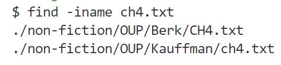
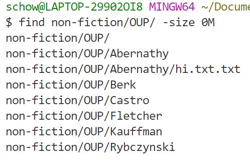
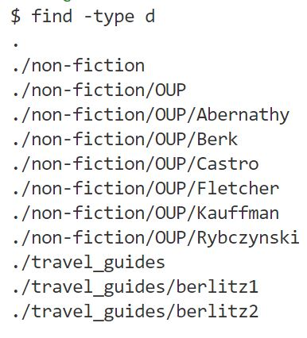
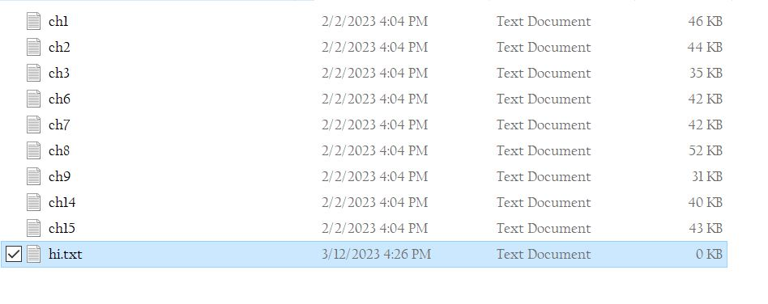
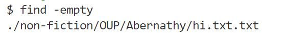

# Lab Report 5: Revisiting Previous Labs

In Lab 3, we explored different commands. I did not realize that there were such a plethora of commands till that lab. For lab report 5, I will research more command options and provide examples of them working.

I chose to work with grep command. For this re-exploration, I will explore different options with the find command

### 1) -iname
This command searches for a file, insensitive of case.

Ex.

    find -iname ch4.txt

I used the -iname command with find, and it worked as expected. It returned the locations of two ch4.txt files, even though they have different capitalizations.

### 2) -size
This command searches for files of a certain specified size.

Ex. 

    find non-fiction/OUP/ -size 0M

In this example, I searched for all files of size 0. The results were all the directory locations as well as the empty file I created for a later example. Thus, it worked as expected.

### 3) -type d
This command searches by directories.

Ex.

    find -type d

In this example, I used find to search for all the directories in docsearch/written_2.

### 4) -empty
This command searches for empty files.

Ex.

    find - empty

In this example, I created an empty file in the nonfiction/OUP/Abernathy directory.

Then, I used the -empty command to search for it. As expected, it found the empty file I created.
